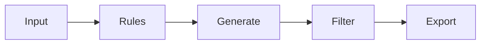

# wordlist-generator-tool 🔐⚡

  

*Turn rules, patterns, and raw data into precision wordlists — in seconds, not scripts.*

  

## 🧭 Overview

A wordlist is only as good as the logic behind it. **wordlist-generator-tool** is a standalone Windows utility built for security researchers, CTF players, sysadmins auditing password policy, and QA engineers fuzzing input fields. It replaces the usual pile of one-off scripts and half-remembered `awk` one-liners with a single deterministic engine: define your rules once, generate consistent, reproducible wordlists every time.

The domain has always had a gap between "quick and dirty" (a text file typed by hand) and "overkill" (full-blown mutation frameworks with a learning curve). This tool sits in between — a native, dependency-free binary that understands charsets, masks, Markov-style pattern learning, case permutations, leetspeak substitution, and combinator logic out of the box. No terminal required, no runtime to install, no config file to hand-edit.

It exists because wordlist generation shouldn't be a chore bolted onto a bigger toolkit. Whether you're building a targeted list from a company's naming conventions, generating brute-force candidate sets for password audits, or stress-testing form validation with structured junk data, this tool treats wordlist creation as a first-class task — fast, transparent, and fully under your control.

## 🚀 Get It

> [!TIP]
> The landing page always ships the current build. Bookmark it — that's the only download source you need.

---

## 🧩 What It Actually Does

- **Mask-driven generation** — define character classes per position (`?l?l?l?d?d`) and let the engine expand every combination without writing a single loop.

- **Dictionary mutation engine** — feed in a base wordlist and apply case toggling, leetspeak swaps, suffix/prefix injection, and reversal in one pass.

- **Pattern learning from samples** — point it at an existing corpus (names, slogans, leaked-style samples you own) and it infers structural patterns to extrapolate new candidates.

- **Combinator mode** — merge two or more lists (e.g. first names × years × symbols) into a cartesian-product wordlist with size estimation before you commit disk space.

- **Smart deduplication** — streaming dedupe keeps memory flat even on multi-gigabyte outputs; no more loading everything into RAM first.

- **Rule-based filtering** — enforce min/max length, required character classes, or regex exclusion so your output matches a target policy exactly.

- **Live size estimator** — see projected line count and file size *before* generation starts, so you don't accidentally fill your disk.

- **Export flexibility** — plain `.txt`, gzip-compressed, or chunked into fixed-size files for tools with input limits.

> [!NOTE]
> Every generation run is deterministic given the same seed and ruleset. Reproducibility is a feature, not an accident.

---

## 🏁 First Run, Start to Finish

1. Open the landing page (button above) and download the latest build.

2. Run the executable — no installer, no admin prompt, no background service.

3. Pick a mode: **Mask**, **Mutation**, **Combinator**, or **Pattern Learn**.

4. Set your output path, hit **Generate**, and watch the live counter climb.

> [!IMPORTANT]
> Windows may flag the first launch with a SmartScreen prompt because the binary is unsigned. Click "More info → Run anyway." This is normal for small independent tools.

---

## 💻 System Requirements

| Component | Requirement |
|---|---|
| OS | Windows 10 or Windows 11 (64-bit) |
| RAM | 4 GB minimum, 8 GB recommended for large combinator jobs |
| Disk | Depends on output size — estimator warns before write |
| Dependencies | None — fully standalone, no runtime install |
| Internet | Not required after download |

---

## ⚙️ How It Works

The pipeline is intentionally linear — no hidden background processing, no telemetry calls, no surprise steps.

1. **Input** — you define a mask, load a base list, or select a sample corpus.

2. **Rule parsing** — the engine validates your ruleset and estimates output size.

3. **Generation** — combinations are streamed, not buffered, keeping memory usage predictable.

4. **Filtering** — length, charset, and regex rules trim the stream in real time.

5. **Export** — results write directly to disk in your chosen format.

---

## 🛠️ Troubleshooting

**Q: Generation stopped mid-way with no error.**
A: Check disk space — the estimator warns you, but external factors (antivirus quarantine, full drive) can still interrupt writes.

**Q: My combinator job estimates a 40 GB file. Is that normal?**
A: Yes — cartesian products grow fast. Narrow your input lists or add length filters before generating.

**Q: Pattern Learn mode produces repetitive results.**
A: Your sample corpus is likely too small or too uniform. Feed it a larger, more varied sample set for richer pattern extraction.

**Q: Windows Defender flagged the executable.**
A: Common with unsigned indie tools. Verify the download came from the official landing page, then allow it manually.

**Q: Can I resume an interrupted generation?**
A: Not currently — chunked export mitigates this by writing completed segments incrementally, so partial progress isn't fully lost.

**Q: The app window looks blurry on my 4K monitor.**
A: Enable high-DPI scaling override in Settings → Display, or right-click the executable → Properties → Compatibility.

---

## 🎨 UI / UX Details

<strong>Keyboard shortcuts</strong>

| Shortcut | Action |
|---|---|
| `Ctrl+G` | Start generation |
| `Ctrl+S` | Save current ruleset |
| `Ctrl+O` | Load ruleset or sample file |
| `Esc` | Cancel active job |
| `Ctrl+E` | Export estimate report |

<strong>Themes & settings</strong>

- Dark and light themes, switchable without restart.

- Adjustable buffer size for streaming generation (trade RAM for speed).

- Optional sound cue on job completion.

- Persistent last-used ruleset across sessions.

> [!WARNING]
> Disabling the size estimator (Settings → Advanced) removes the pre-generation safety check. Only turn this off if you're confident in your ruleset.

---

## 🤝 Contributing & Community

Bug reports, ruleset ideas, and mask syntax suggestions are all welcome via Issues. Pull requests should target a single change — new export format, new mask token, one bugfix — to keep review fast.

  

> Discussions tab is the right place for ruleset design questions — Issues are for bugs and concrete feature requests.

---

## 📜 License

Released under the [MIT License](LICENSE), 2026.

## ⚠️ Disclaimer

This tool generates text data based on user-defined rules. Use it only on systems, accounts, and data you own or have explicit authorization to test. The maintainers assume no responsibility for misuse.

---

## 📦 Changelog

**v2026.2** — Added chunked export, streaming dedupe rewrite, dark theme polish.

**v2026.1** — Introduced Pattern Learn mode, live size estimator, regex filtering.

**v2026.0** — Initial public release: mask engine, mutation engine, combinator mode.

